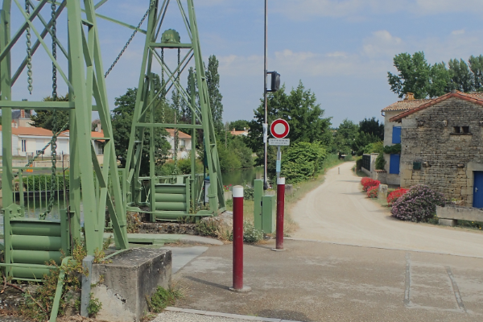
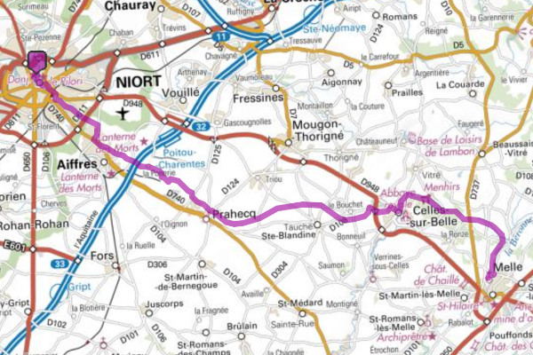

# Balades pour cycliste starter pack 2020

\

Les beaux jours sont là, une grande envie de liberté se fait sentir. Quoi de mieux que de ce balader cheuveux au vent au guidon de votre petite reine qui ne demande qu'a parcouris de nouveau horion.

@VilliVelo vous proposes quattres balades de (nb de km) a (nb de km) faciles et accessible. De bonne idée pour un pic-nique.

Quattres sorties pour découvrir les alentours de notre belle ville de niort.

1. Le marais par la sèvres
1. balade 2
1. balade 3
1. balade 4

## Le marais par la sèvres

- 17 km
- 90 % de chemin sans voiture
- idéal pour une balade familiale
- la classique des classiques
- liens vers le tracé

**Départ de port Boinot** Suivre le quai metayer qui longe la sèvre.
Au fil du chemin vous passerez en face des jardins familiaux de la société d'horticulture des deux-sèvres [^1], plus loin vous aurez une vue imprenable sur la base nautique et le parc des expositions de Niort.
Passez sous le pont du boulevard Willy Brand vous suivrez un chemin de terre entre sèvre et champs.

Devant vous un pont bleu, vous devrez le traverser pour poursuivre votre chemin dans le marais en direction de Magné. L'entrée de la ville est marqué par un pont vert à bascule, ne le prenez pas tourner à droite sur le chemin de terre.

Vous cheminerez en suivant la sèvre

adipiscing elit. Quisque at gravida lectus. Donec eu neque cursus, ultricies nibh luctus, tincidunt nunc. In imperdiet, sapien vel molestie hendrerit, justo eros rutrum risus, et rhoncus lectus magna rhoncus tortor. Integer nec dolor vitae eros mollis mollis at vel quam. Aenean neque nisi, mollis eget eros et, consequat condimentum enim. Cras pulvinar tempor blandit. Cras viverra faucibus mi. Integer faucibus nulla vel erat ornare, ac fringilla ligula convallis. Ut risus ligula, viverra et erat ut, pulvinar egestas erat. Vivamus felis sem, euismod nec maximus a, scelerisque id dui. Duis fringilla, dui vitae convallis aliquam, mi neque molestie ante, id iaculis neque orci eu nulla. Aenean ut pellentesque eros. Praesent ac odio et lorem dapibus lobortis at quis leo.

Maecenas enim velit, porta et dapibus vel, vulputate vel enim. Proin pretium vitae lorem vel ornare. Proin efficitur a est vitae blandit. Vestibulum ex justo, ullamcorper quis aliquet vitae, facilisis eget metus. Donec consequat leo porta elit lacinia, ac condimentum ligula eleifend. Maecenas in orci tincidunt, dignissim massa tristique, euismod lorem. Sed est nisi, volutpat id sapien eu, tempor dapibus purus. Maecenas a faucibus risus. Aenean varius velit mi, sit amet venenatis dolor egestas in. Praesent interdum volutpat erat ut rhoncus.

[^1]: [Société d'horticulture](https://sh79.jimdofree.com/)

## Balade 2

- nb de km
- liens vers le tracé

**Départ de la place de ...** Lorem ipsum dolor sit amet, consectetur adipiscing elit. Quisque at gravida lectus. Donec eu neque cursus, ultricies nibh luctus, tincidunt nunc. In imperdiet, sapien vel molestie hendrerit, justo eros rutrum risus, et rhoncus lectus magna rhoncus tortor. Integer nec dolor vitae eros mollis mollis at vel quam. Aenean neque nisi, mollis eget eros et, consequat condimentum enim. Cras pulvinar tempor blandit. Cras viverra faucibus mi. Integer faucibus nulla vel erat ornare, ac fringilla ligula convallis. Ut risus ligula, viverra et erat ut, pulvinar egestas erat. Vivamus felis sem, euismod nec maximus a, scelerisque id dui. Duis fringilla, dui vitae convallis aliquam, mi neque molestie ante, id iaculis neque orci eu nulla. Aenean ut pellentesque eros. Praesent ac odio et lorem dapibus lobortis at quis leo.

Maecenas enim velit, porta et dapibus vel, vulputate vel enim. Proin pretium vitae lorem vel ornare. Proin efficitur a est vitae blandit. Vestibulum ex justo, ullamcorper quis aliquet vitae, facilisis eget metus. Donec consequat leo porta elit lacinia, ac condimentum ligula eleifend. Maecenas in orci tincidunt, dignissim massa tristique, euismod lorem. Sed est nisi, volutpat id sapien eu, tempor dapibus purus. Maecenas a faucibus risus. Aenean varius velit mi, sit amet venenatis dolor egestas in. Praesent interdum volutpat erat ut rhoncus.

## Balade 3

- nb de km
- liens vers le tracé

**Départ de la place de ...** Lorem ipsum dolor sit amet, consectetur adipiscing elit. Quisque at gravida lectus. Donec eu neque cursus, ultricies nibh luctus, tincidunt nunc. In imperdiet, sapien vel molestie hendrerit, justo eros rutrum risus, et rhoncus lectus magna rhoncus tortor. Integer nec dolor vitae eros mollis mollis at vel quam. Aenean neque nisi, mollis eget eros et, consequat condimentum enim. Cras pulvinar tempor blandit. Cras viverra faucibus mi. Integer faucibus nulla vel erat ornare, ac fringilla ligula convallis. Ut risus ligula, viverra et erat ut, pulvinar egestas erat. Vivamus felis sem, euismod nec maximus a, scelerisque id dui. Duis fringilla, dui vitae convallis aliquam, mi neque molestie ante, id iaculis neque orci eu nulla. Aenean ut pellentesque eros. Praesent ac odio et lorem dapibus lobortis at quis leo.

Maecenas enim velit, porta et dapibus vel, vulputate vel enim. Proin pretium vitae lorem vel ornare. Proin efficitur a est vitae blandit. Vestibulum ex justo, ullamcorper quis aliquet vitae, facilisis eget metus. Donec consequat leo porta elit lacinia, ac condimentum ligula eleifend. Maecenas in orci tincidunt, dignissim massa tristique, euismod lorem. Sed est nisi, volutpat id sapien eu, tempor dapibus purus. Maecenas a faucibus risus. Aenean varius velit mi, sit amet venenatis dolor egestas in. Praesent interdum volutpat erat ut rhoncus.

## Balade 4

- nb de km
- liens vers le tracé

**Départ de la place de ...** Lorem ipsum dolor sit amet, consectetur adipiscing elit. Quisque at gravida lectus. Donec eu neque cursus, ultricies nibh luctus, tincidunt nunc. In imperdiet, sapien vel molestie hendrerit, justo eros rutrum risus, et rhoncus lectus magna rhoncus tortor. Integer nec dolor vitae eros mollis mollis at vel quam. Aenean neque nisi, mollis eget eros et, consequat condimentum enim. Cras pulvinar tempor blandit. Cras viverra faucibus mi. Integer faucibus nulla vel erat ornare, ac fringilla ligula convallis. Ut risus ligula, viverra et erat ut, pulvinar egestas erat. Vivamus felis sem, euismod nec maximus a, scelerisque id dui. Duis fringilla, dui vitae convallis aliquam, mi neque molestie ante, id iaculis neque orci eu nulla. Aenean ut pellentesque eros. Praesent ac odio et lorem dapibus lobortis at quis leo.

Maecenas enim velit, porta et dapibus vel, vulputate vel enim. Proin pretium vitae lorem vel ornare. Proin efficitur a est vitae blandit. Vestibulum ex justo, ullamcorper quis aliquet vitae, facilisis eget metus. Donec consequat leo porta elit lacinia, ac condimentum ligula eleifend. Maecenas in orci tincidunt, dignissim massa tristique, euismod lorem. Sed est nisi, volutpat id sapien eu, tempor dapibus purus. Maecenas a faucibus risus. Aenean varius velit mi, sit amet venenatis dolor egestas in. Praesent interdum volutpat erat ut rhoncus.
