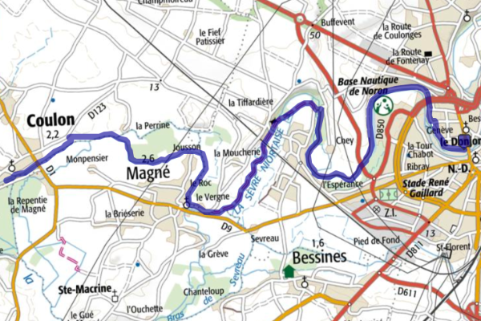
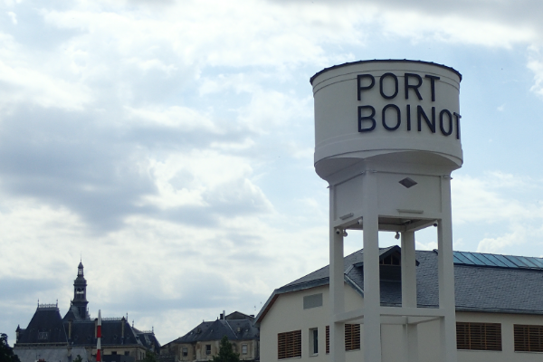
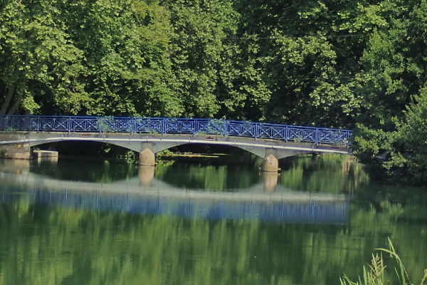
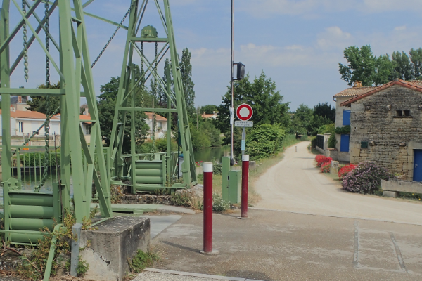
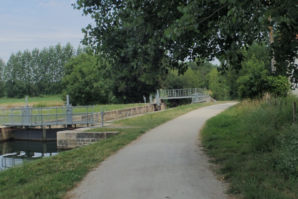

- Départ:Niort -> Arrivé:Coulon 17 km
- 90 % de chemin sans voiture
- idéal pour une balade familiale
- la classique des classiques
- liens vers le tracé [ici](./gpx/balade_01.gpx)

**Départ de Port Boinot** Suivre le quai Metayer qui longe la Sèvre.
Au fil du chemin vous passerez en face des jardins familiaux de la société d'horticulture des Deux-Sèvres [^1], plus loin vous aurez une vue imprenable sur la base nautique et le parc des expositions de Niort.
Passez sous le pont du boulevard Willy Brandt vous suivrez un chemin de terre entre Sèvre et champs.

Arrivé en vue du **Pont de la Roussile** traversez-le pour poursuivre votre chemin dans le marais en direction de Magné. L'entrée de la ville est marquée par un **pont vert à bascule**, ne le prenez pas et tournez à droite sur le chemin de terre.

Vous cheminerez en suivant la Sèvre sur votre gauche une farandole de champs et prairies sur votre droite. Vous passerez devant les **écluses**.

Encore quelques coups de pédales et vous serez arrivés a Coulon que vous traverserez pour arriver sur un parc où vous pourrez pique-niquer.
Vous pouvez poser pied à terre vous êtes arrivés.Vous pouvez également choisir un des nombreux restaurants sur le Bord de la Sèvres. Enfin, le Département vient d'ouvrir une Maison du Marais [^2] dédiée au tourisme sur la place de la Coutume. Prenez le temps de la visiter.

[^1]: [Société d'horticulture](https://sh79.jimdofree.com/)
[^2]: [Maison du Marais](https://www.maison-marais-poitevin.fr/)
