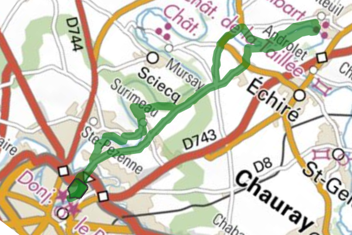
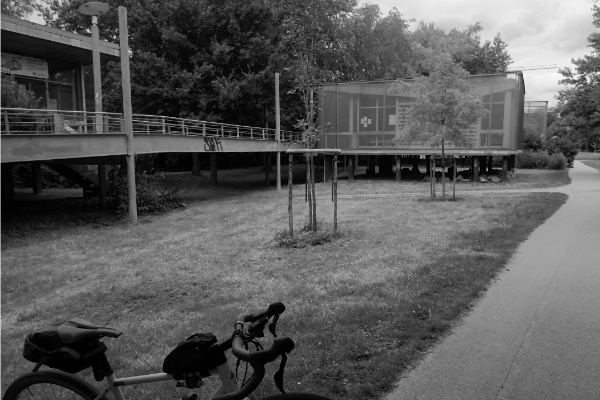
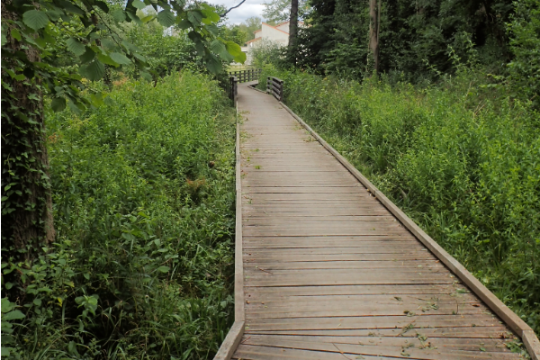
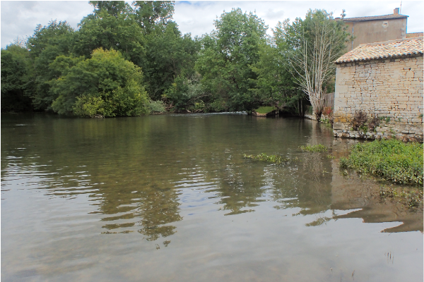
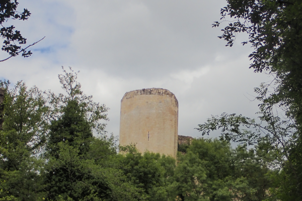
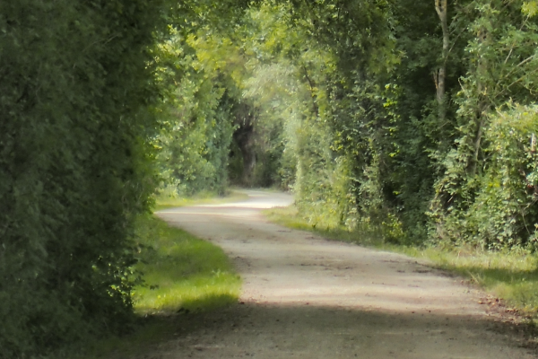
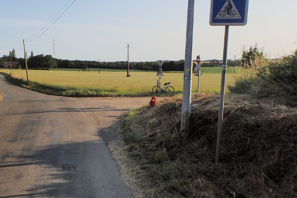

- Départ : Niort -> Coudray-Salbart -> Arrivé : Niort (24 km)
- 35 % de chemin sans voiture
- balade familiale (⚠️ : vous croiserez des voiture)
- quelques montées
- beaux tronçons ombragés (bien en été)
- Le tracé [GPX](https://villovelo.github.io/balade_2020/gpx/balade_02.gpx) | Version [web](https://villovelo.github.io/balade_2020/balade_02.html?source=pdf) | Version [pdf](https://villovelo.github.io/balade_2020/balade_02.pdf)

**Départ du parc [pré-leroy](https://www.vivre-a-niort.com/fr/cadre-de-vie/environnement/parcs-et-jardins/parc-de-pre-leroy/index.html)** non loin du local @Villovelo (n'hésitez pas à passer dire bonjour) vous démarrez en direction de la piscine, prenez le pont qui traverse la Sèvre, tournez à gauche, suivez la route jusqu'a arriver au croisement de la sortie de la rocade, suivez alors le chemin blanc sur votre gauche. Laisser vous guider par celui ci il vous mènera à côté du captage du syndicat des eaux du vivier [^1]

Continuez jusqu'a remonter la rue Dante qui vous emmènera du quartier Cholette à Surimeau. passez à coté de l'école de la Mirandelle et profiter de la descente. suivez la route qui vous conduis hors de Niort. Poursuivez pour arriver à Moulin Neuf, suivez alors la rue du moulin neuf qui vous guide au Lavoir.

Laissez le lavoir derrière vous et continuez la route qui peux à peux laisse place à un chemin blanc. Certains tronçons sont un peu chaotique. Pour les plus sportifs c'est le moment de profiter de ces sensations qui rappelle "l'enfer du nord".

à la fin du chemin blanc tounez à gauche. Devant vous ce dresse le chateau de Coudrais-Salbart[^2] que vous pouvez visiter. Suivez les indications qui vous mènent à l'aire de pique-nique où vous pourrez vous arrêter.

Après l'aire de pique-nique continuer tout droit et laisser vous porter par bruit des clapotis de la Sèvre sur votre gauche. Vous cheminerez sur un chemin blanc bien ombragé, un vrai plaisir en été.
Toutes les bonnes choses ont une fin, vous devrez rejoindre l'asphalte en tournant a gauche à la fin du chemin blanc.

Vous suivrez cette route jusqu'a revenir sur la rue du chateau menu que vous avez emprunter à l'allé. Vous pouvez retourner sur niort en continuant tout droit où comme on vous le conseil de tourner à droite (rue de la Ganoche) pour continuer en suivant l'itineraire de la vélofrancette[^3] qui vous mene à niort en passant par surimeau. Encore quelques coup de pédale et hop vous êtes revenus à votre point de départ.

[^1]: [Syndicat des eaux du vivier](http://www.eaux-du-vivier.fr/fr/dou-vient-votre-eau/ressources/captages-principaux/index.html)
[^2]: [Le chateau de Coudray Salbart](https://www.coudraysalbart.fr/)
[^3]: [La VéloFrancette Champdeniers-St-Denis / Niort](https://www.lavelofrancette.com/itineraire/champdeniers-st-denis-niort)
