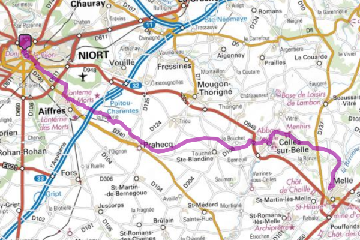
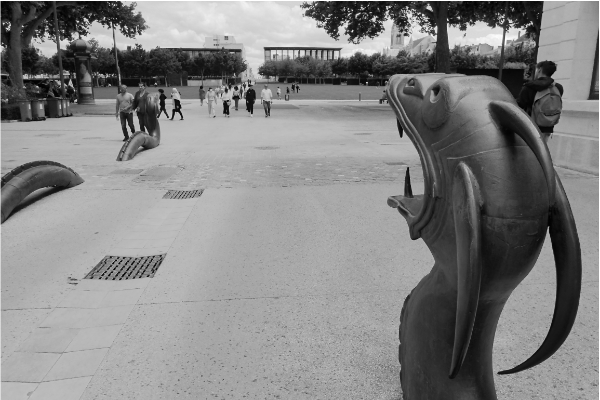
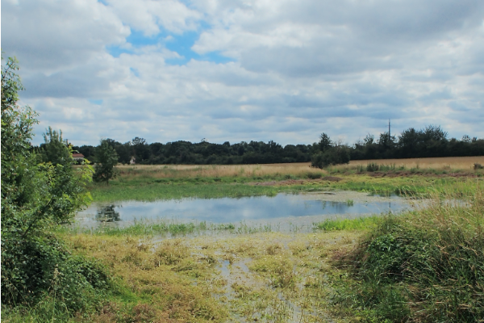
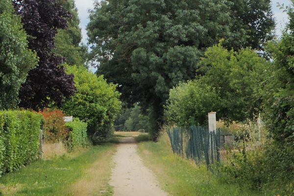
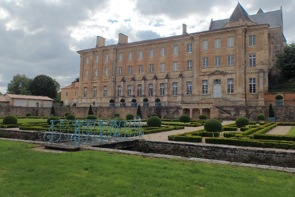
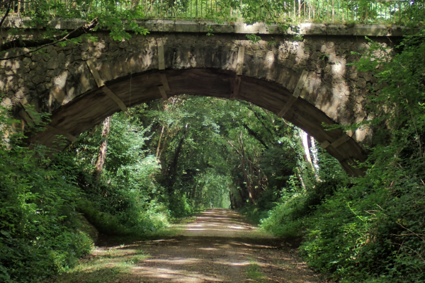

- Départ : Niort -> Arrivé Celles-sur-Belle / Melle (35 km)
- 60 % de chemin sans voiture
- Découverte du [Ruban Vert](https://www.af3v.org/les-voies-vertes/voies/141-le-ruban-vert-de-melle-a-celles-sur-belle/)
- possibilité de prolonger la halte à Celles sur Belle
- possibilité de [camper à Melle](https://mairie-melle.fr/component/content/article?id=38:hebergement) (aire de camping car)
- le Ruban Vert est un léger plat montant
- Le tracé [GPX](https://villovelo.github.io/balade_2020/gpx/balade_03.gpx) | Version [web](https://villovelo.github.io/balade_2020/balade_03.html?source=pdf) | Version [pdf](https://villovelo.github.io/balade_2020/balade_03.pdf)

**Départ Place de la [Brèche](https://www.vivre-a-niort.com/fr/cadre-de-vie/environnement/parcs-et-jardins/jardins-de-la-breche/index.html)** Contournez la place pour prendre l'Avenue de Limoges, puis suivre l'itinéraire vélo "Terre des Sports" (direction Décathlon / l'Acclameur). En vue du magasin Décathlon à la fin du chemin blanc tournez à droite. Descendez vers Aiffres en bas de la rue de Souché tournez à gauche sur la Route de Niort (**attention cette route est très fréquentée**). Au bout de 500m quittez cette route en prenant à gauche sur la Rue du Moulin. Poursuivez dans cette rue puis passez en face du rond point. Poursuivez votre chemin en prenant le pont qui enjambe l'autoroute.

Sur votre route vous passerez par le [puits artésien](https://fr.wikipedia.org/wiki/Puits_art%C3%A9sien) de la Fosse de Paix. A ce stade vous êtes bientôt arrivés à Prahecq et la première partie du Ruban Vert[^1] vous attend.

Le Ruban Vert est la reconversion en chemin de l'ancienne voie ferrée entre Melle et Celles-sur-Belle. Ce chemin en sable stabilisé offre un parcours champêtre. En regardant attentivement sur le bas côté vous verrez des traces de l'ancien ballast. N'oubliez pas, malgré le plaisir de laisser filer votre monture le long de ce chemin, que celui-ci croise des routes. Veillez à bien respecter les panneaux Stop.

A la fin de la première partie du Ruban Vert prenez à gauche et cheminez jusqu'au centre ville de Celles-sur-Belle.
Vous pouvez y faire une halte prolongée en visitant l'Abbaye Royale Notre-Dame ou choisir votre casse-croûte du soir à la Maison des [Fromages de Chèvre](http://www.maisondesfromagesdechevre.com/)
Si vous souhaitez continuer vers Melle, dirigez-vous vers la **Route de Vitré**

En continuant la Route de Vitré vous retrouverez les indications pour accéder à la deuxième partir du Ruban Vert.
Vous voilà lancez en direction de Melle, cette partie paraît un peu plus sauvage. Veuillez respecter les panneaux Stop qui seront moins nombreux sur cette partie.
La trace GPS se termine au Camping de Melle[^3] où vous pourrez remplir vos gourdes. A partir de ce lieu, vous pouvez visiter Melle[^2], ses 3 églises romanes, cheminez le long de l'Arboretum et du chemin de la Découverte entre autres choses.

[^1]: [Ruban Vert](https://www.af3v.org/les-voies-vertes/voies/141-le-ruban-vert-de-melle-a-celles-sur-belle/)
[^2]: [Office de tourisme du Mellois](https://decouvertes.paysmellois.org/)
[^3]: [Camping de mon Village de Melle](https://campingcarpark.com/shop/sejour/nouvelle-aquitaine/camping-de-village-area-of-melle/)
