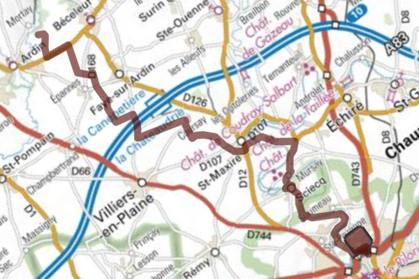

- Départ:Niort -> Arrivée:Pigeonnier de Pouzay (35 km)
- Bonne condition physique obligatoire
- Balade non familiale
- Profil gravel (chemin blanc)
- 30 % de chemin sans voiture
- Bien suivre la trace GPS (vous roulerez à travers champ)
- Le tracé [GPX](https://villovelo.github.io/balade_2020/voir_trace.html?trace=./gpx/balade_04.gpx) | Version [web](https://villovelo.github.io/balade_2020/balade_04.html?source=pdf) | Version [pdf](https://villovelo.github.io/balade_2020/balade_04.pdf)

**Départ du [stade Espinassou](https://www.vivre-a-niort.com/fr/services-publics/les-equipements/equipements-sportifs/stade/stade-espinassou/index.html)** Descendez la rue Sarrazine, passez le pont de la rocade et tournez à gauche pour passer à coté du circuit de BMX. Continuez le chemin en descendant le champ. Tournez à droite sur le chemin blanc qui mène à la patte d'oie et prenez à droite Chemin de la Maison Neuve.
Restez sur cette route jusqu'au chemin sur votre gauche qui mène à la passerelle. Après le pont tournez à droite (Rue de Coquelone) puis à la fin de la route goudronnée poursuivez sur le chemin de terre qui vous fait face.
Il longe un champ et la Sèvre. A la fin de ce chemin tournez à droite, vous emprunterez la route sur quelques mètres pour ensuite prendre le chemin blanc dit le Chemin des Pêcheurs. Vous passerez une enfilade de cabanes de pêcheurs sur votre droite. Le chemin se termine en une montée pavée attention ça monte.
Tournez à droite pour un dernier effort en direction de Siecq en suivant le Chemin de Compère.
Entrez dans Siecq jusqu'à la Rue du Moulin puis prenez la rue du lavoir. Arrivé au bord de Sèvre dirigez-vous sur la droite vers le bateau à chaîne.

Le bateau à chaîne vous permet de traverser la Sèvre et remonter vers le château de [Mursay](http://www.lesamisduchateaudemursay.fr/).

Sur l'autre rive, suivez le chemin: vous passerez Mursay puis Saint-Maxire.
En sortant de Saint-Maxire reportez-vous à la trace GPS: les chemins empruntés à travers champ sont pour les tracteurs (qui restent tout à fait praticables). Cette partie assez longue vous permettra de tester votre endurance.

Vous êtes arrivés à destination: le pigeonnier de Pouzay. A l'intérieur ont été construites 2 700 niches ou boulins, pouvant abriter jusqu'à 5 000 pigeons. Dans l'ancien temps, les seigneurs qui venaient sur leurs terres à la campagne devaient trouver de la nourriture en abondance. Le pigeonnier constituait un excellent garde-manger. Aujourd'hui, un chêne centenaire pousse au centre du pigeonnier, un arbre classé parmi les 210 arbres remarquables de France.
Le pique-nique est autorisé autour du pigeonnier.
