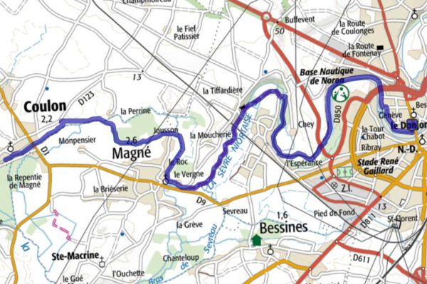

## Première balade : Le marais par la sèvre

- Départ : Niort -> Arrivé : Coulon (17 km)
- 90 % de chemin sans voiture
- idéal pour une balade familiale
- la classique des classiques
- Le tracé [GPX](https://villovelo.github.io/balade_2020/gpx/balade_01.gpx) | Version [web](https://villovelo.github.io/balade_2020/balade_01.html?source=pdf) | Version [pdf](https://villovelo.github.io/balade_2020/balade_01.pdf)

La balade familiale par excellence une majorité de route sans croiser de voiture. Plus d'information [ici](https://villovelo.github.io/balade_2020/balade_01.html?source=index)

## Deuxième balade : Boucle château de Coudray-Salbart

- Départ : Niort <-> Coudray-Salbart (24 km)
- 35 % de chemin sans voiture
- balade familiale (⚠️ : vous croiserez des voitures)
- quelques montées
- beaux tronçons ombragés (bien en été)
- Le tracé [GPX](https://villovelo.github.io/balade_2020/gpx/balade_02.gpx) | Version [web](https://villovelo.github.io/balade_2020/balade_02.html?source=pdf) | Version [pdf](https://villovelo.github.io/balade_2020/balade_02.pdf)

A la découverte du château de Coudray-Salbart boucle sur un autre bord de la Sèvre. Attention vous empreinterez des routes que vous partagerez avec les voitures. Plus d'information [ici](https://villovelo.github.io/balade_2020/balade_02.html?source=index)

## Troisième balade : En route vers le Mellois

- Départ : Niort -> Arrivé Celles-sur-Belle / Melle (35 km)
- 60 % de chemin sans voiture
- Découverte du [Ruban Vert](https://www.af3v.org/les-voies-vertes/voies/141-le-ruban-vert-de-melle-a-celles-sur-belle/)
- possibilité de prolonger la halte à Celles sur Belle
- possibilité de [camper à Melle](https://mairie-melle.fr/component/content/article?id=38:hebergement) (aire de camping car)
- le Ruban Vert est un léger plat montant
- Le tracé [GPX](https://villovelo.github.io/balade_2020/gpx/balade_03.gpx) | Version [web](https://villovelo.github.io/balade_2020/balade_03.html?source=pdf) | Version [pdf](https://villovelo.github.io/balade_2020/balade_03.pdf)

A quelques kilomètres de Niort, Le Ruban Vert un itinéraire apaisé pour cheminé dans le Mellois.

## Quatrième balade : Bientôt
